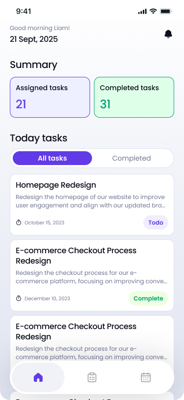
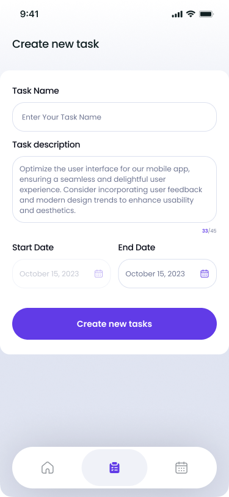

# 📝 Task Management

<div align="center">
    <div>
        
        <p>Figure: Task Management</p>
    </div>
</div>

A beautifully designed **Task Management** application built with **Flutter**. This app helps users manage their daily tasks efficiently with an intuitive UI and smooth interactions.


---

## 🚀 Features

✅ **Task Management** – Create, View, Edit, and Delete tasks  
✅ **Task Categories** – Organize tasks into different statuses (To-do, Completed)  
✅ **Calendar View** – Visual representation of tasks by date  
✅ **Local Storage** – Save and retrieve tasks using Hive database  
✅ **State Management** – Powered by `flutter_bloc` for a seamless experience  
✅ **Beautiful UI** – Built with **Flutter**, `flutter_svg`, and `Poppins` font  
✅ **Clean Architecture** – Organized into `Presentation`, `Domain`, and `Data` layers for scalability and maintainability  


---

## 🎨 App Logo  

**Text:** `"TM"`  
**Text Color:** `#FFFFFF`  
**Background Color:** `#613BE7`  

---

### 📂 Folder Structure (Clean Architecture) 

lib/
│── core/ # Common utilities & configurations
│── data/ # Repositories & Data data sources
│── domain/ # Business logic & use cases
│── presentation/ # UI & State Management
├── l10n/ # Localization files
├── generated/ # Generated files (e.g., assets, colors, fonts)
├── app.dart # App configuration and setup
│── main.dart # App entry point

---

## 📸 Screenshots

<div align="center">
  <table>
    <tr>
      <td align="center">
        
        <p>Homepage</p>
      </td>
      <td align="center">
        
        <p>Create New Task Page</p>
      </td>
      <td align="center">
        
        <p>All Task Page</p>
      </td>
      <td align="center">
        
        <p>View Task Page</p>
      </td>
    </tr>
  </table>
</div>
---

## 📲 Download APK

🔗 **[Download APK](https://drive.google.com/your-apk-link)** <!-- Replace with your actual APK link -->

---

## Setup
   ```bash
   # Clone the repository
   $ git clone https://github.com/shahiduldeowan/flutter_task_management.git
   $ cd flutter_task_management/

   # Install dependencies
   $ flutter pub get

   # Run the app
   $ flutter run
  ```

## Authors

- [@shahiduldeowan](https://www.linkedin.com/in/shahiduldeowan/)